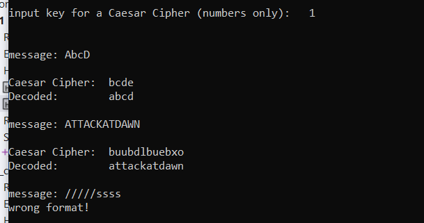

# Caesar Cipher in Cryptography: C++ Implementation



The best explanation can be found here: [Caesar Cipher in Cryptography](https://www.geeksforgeeks.org/caesar-cipher-in-cryptography/)

#### A quick recap on the algorithm:

1. Choose a shift value between 1 and 25.
2. Write down the alphabet in order from A to Z.
3. Create a new alphabet by shifting each letter of the original alphabet by the shift value. For example, if the shift value is 3, the new alphabet would be:
```
   A B C D E F G H I J K L M N O P Q R S T U V W X Y Z

   D E F G H I J K L M N O P Q R S T U V W X Y Z A B C
```
5. Replace each letter of the message with the corresponding letter from the new alphabet. For example, if the shift value is 3, the word “hello” would become “khoor”.
6. To decrypt the message, shift each letter back by the same amount. For example, if the shift value is 3, the encrypted message “khoor” would become “hello”.

***

The project uses file `example.txt` located in the same dir. It parses line by line to code and decode each message. Invalid keyboard and file input is handled using `std::regex_match`.
```
template<typename ReturnType>
auto validate_input(const std::string &message, const std::regex &pattern, const std::function<ReturnType(const std::string &)> &converter) {
	std::string input;
	
	do {
		std::cout << message;
		std::getline(std::cin, input);
	} while (!std::regex_match(input, pattern));

	return converter(input);
}
```
